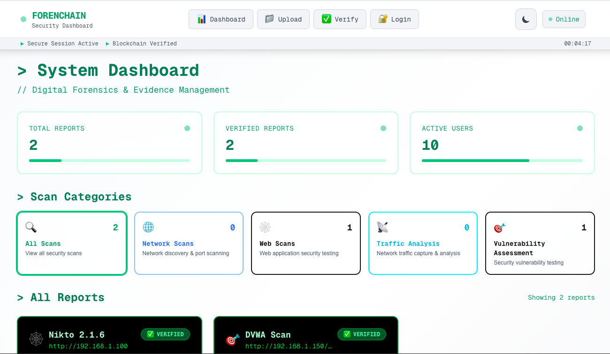
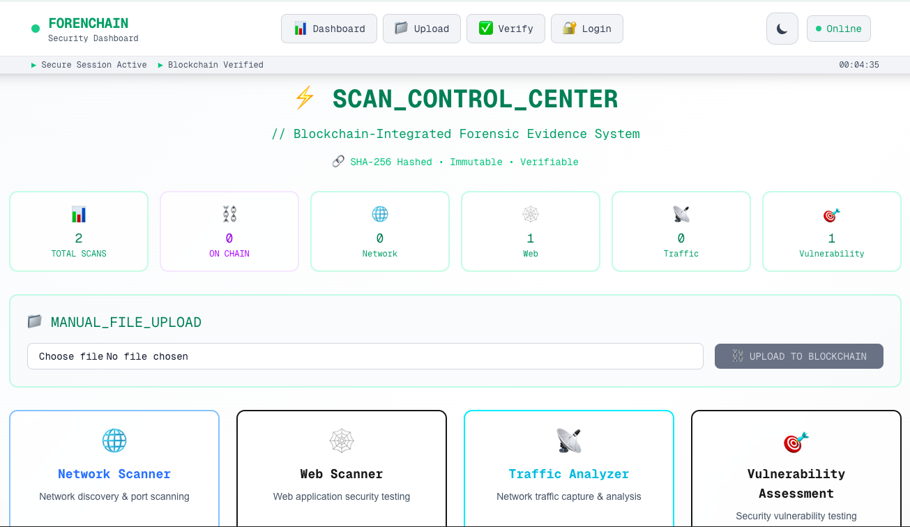
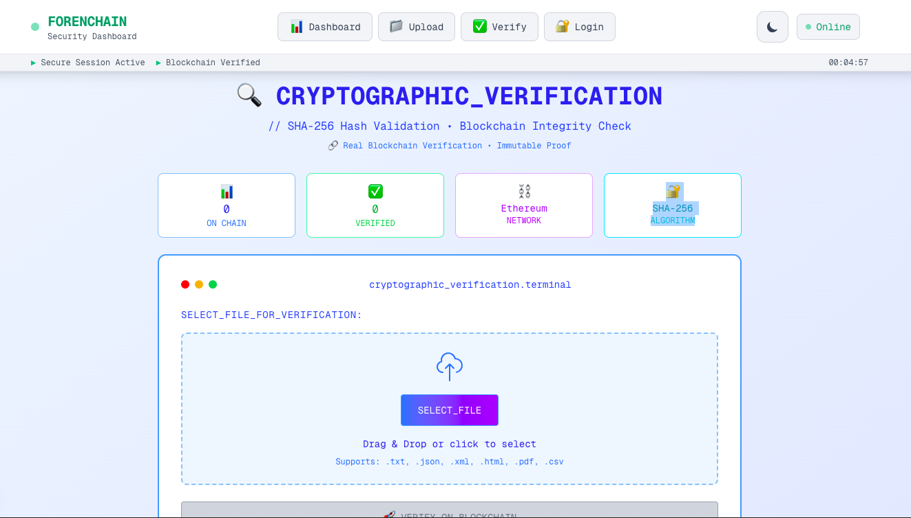
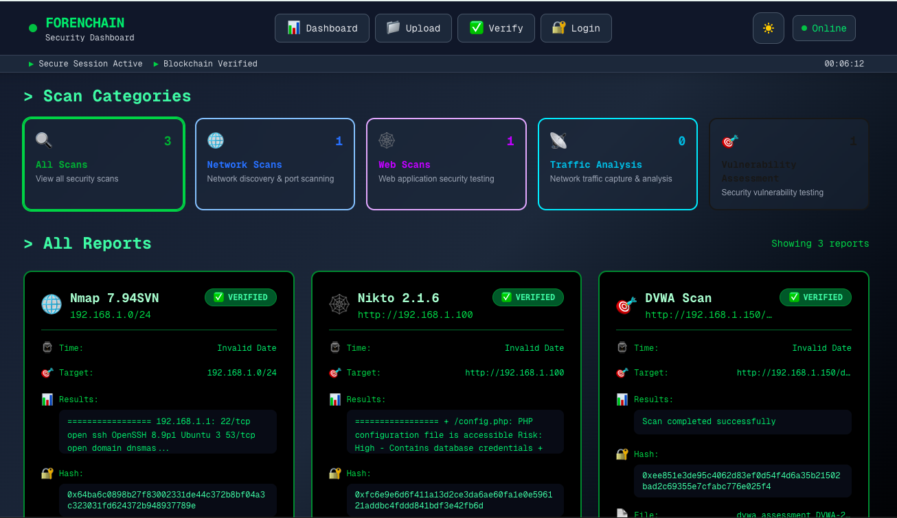

# 🧠 ForenChain — Blockchain-Powered Forensic Evidence System 🔍⛓️

A full-stack decentralized web application ensuring the integrity and immutability of forensic scan reports 🧾 using **Ethereum Blockchain** and **SHA-256 hashing**.  
Built for secure cybersecurity evidence management, ForenChain guarantees that every uploaded report is tamper-proof, verifiable, and traceable.

---

## 📸 Screenshots

| Preview | Description |
|:--|:--|
|  | 🧾 Dashboard — View all uploaded scan reports |
|  | ⛓️ Blockchain Verification — Upload report integrity |
|  | ⛓️ Blockchain Verification — Verify report integrity |
|  | 🌙 Dark Mode — Sleek UI with light/dark theme toggle |

---

## 🚀 Key Features

- ✅ **SHA-256 Cryptographic Verification** – Ensures bulletproof file integrity  
- ✅ **Ethereum Blockchain Anchoring** – Immutable storage for every forensic hash  
- ✅ **MetaMask Authentication** – Web3 wallet-based secure login  
- ✅ **Multiple Scan Types** – Network, Web, Traffic & Vulnerability scanning  
- ✅ **Real-Time Dashboard** – Live blockchain status & verification view  
- ✅ **Adaptive Dark/Light Mode** – Elegant UI with theme switching  
- ✅ **Proof of Integrity System** – Instant authenticity validation  

---

## 🧩 Tech Stack

| Layer | Technologies Used |
|:--|:--|
| 🎨 **Frontend** | Next.js 14, React, Tailwind CSS |
| ⛓️ **Blockchain** | Solidity, Hardhat, Ethers.js |
| 🦊 **Authentication** | MetaMask (Web3 Integration) |
| 💾 **Storage** | Local File System + On-Chain Hash Anchoring |
| 🌐 **Network** | Ethereum (Hardhat Localhost Network) |

---

## ⚙️ Setup Instructions (Step-by-Step)

### 1️⃣ Prerequisites

- 🟢 Node.js 18+  
- 🦊 MetaMask Browser Extension  
- 🧱 Git Installed  

### 2️⃣ Clone & Install Dependencies

```bash
# Clone the repository
git clone https://github.com/yourusername/forenchain.git
cd forenchain

# Install dependencies
npm install
cd frontend && npm install && cd ..
3️⃣ Blockchain Setup
Terminal 1 — Start Local Blockchain

bash
Copy code
npx hardhat node
Terminal 2 — Deploy Smart Contract

bash
Copy code
npx hardhat run scripts/deploy.js --network localhost
⚠️ Important: Copy the deployed contract address from the terminal and update it in your frontend configuration file.

4️⃣ Configure MetaMask
Setting	Value
Network Name	Hardhat Local
RPC URL	http://localhost:8545
Chain ID	31337
Currency Symbol	ETH

Then, import one test account’s private key from the Hardhat node console (Account #0 recommended).

5️⃣ Run the Application
bash
Copy code
cd frontend
npm run dev
🌐 Visit your app here → http://localhost:3000

🧰 Troubleshooting
Issue	Solution
🔌 MetaMask not connecting	Ensure Hardhat node is running and correct network selected
⛽ Transaction failed	Check ETH balance or redeploy contract
🔍 Verification failed	Confirm correct file reupload or ABI version

Debug Commands
javascript
Copy code
// Check blockchain connection
await window.ethereum.request({ method: 'eth_chainId' });

// Get wallet balance
const balance = await provider.getBalance(account);

// Switch MetaMask to Hardhat network
await window.ethereum.request({
  method: 'wallet_switchEthereumChain',
  params: [{ chainId: '0x7A69' }]
});
🧾 Project Overview
🧩 /frontend/pages/upload.js → File upload & hashing UI

⚙️ /utils/blockchain.js → Blockchain transactions & verification logic

💽 /contracts/ForenChain.sol → Smart contract for hash storage

🚀 /scripts/deploy.js → Contract deployment automation

💡 Vision
"ForenChain ensures digital forensic reports remain tamper-proof, verifiable, and decentralized — bringing blockchain-level trust to cybersecurity." 🔐

👨‍💻 Developer
👤 Atul Jha — B.Tech CSE (IoT) | Blockchain & Web Developer Learner

🌟 Support the Project
If you liked this project, consider giving it a ⭐ star on GitHub!
Every star helps and motivates me to build more amazing open-source tools 💪✨
